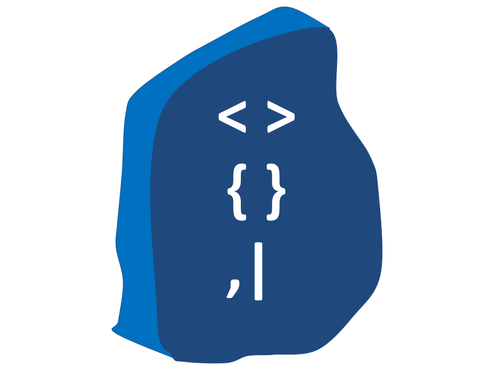

[](https://snyk.io/test/github/my-soc/Rosetta)

[](https://go-rosetta.slack.com)

 

# Rosetta
Rosetta is a Python package that aims to simplify faking and sending those logs by providing the following functions:
- Fake log messages in different formats to test your detection tools and train and test your machine learning models.
- Convert one log format into another.
- Send the fake log message to different log management and analytics tools.

## Installation

- You can install rosetta via pip:
```sh
pip install rosetta
```
- Or you can install it from the source code:
```sh
git clone https://github.com/ayman-m/rosetta.git
cd rosetta
python setup.py install
```
- Once installed, you can import the library in your Python code like this:
```python
- import rosetta
```

## Usage
